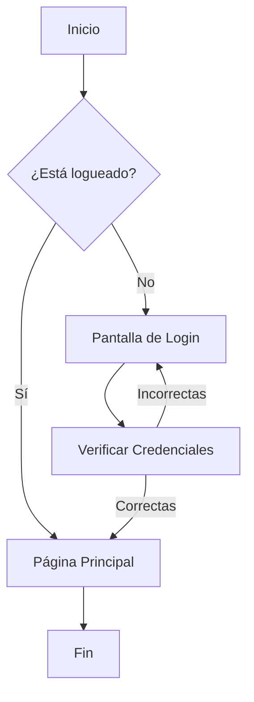

¡Por supuesto! He procesado todo el contenido de la **Guía rápida de Markdown (Sintaxis clásica y de GitHub / MoureDev Pro)** y lo he formateado en código **Markdown nativo y limpio**, listo para copiar directamente a un archivo `.md` de tu repositorio de GitHub.

---

````markdown
# 📝 Guía Rápida de Markdown: Sintaxis Clásica y de GitHub (GFM)

_Basado en la guía de MoureDev Pro ([mouredev.pro/recursos](https://mouredev.pro/recursos))_

---

## 📌 Introducción

**Markdown** es un lenguaje de marcado ligero que permite dar formato a texto plano (legible en cualquier dispositivo) de forma sencilla y legible, convirtiéndose fácilmente en HTML[cite: 4].

Su sintaxis es intuitiva y potente, basada en caracteres simples fáciles de recordar (por ejemplo: `#`, `*`, `[]`, etc.)[cite: 4].

Es ampliamente utilizado en **GitHub**, documentación técnica, blogs, foros, notas personales e interacción con sistemas de IA[cite: 4]. Los archivos procesados son texto plano con extensión `.md`[cite: 4].

---

## 🛠️ Sintaxis Básica (CommonMark)

La sintaxis básica cubre los elementos de formato tradicionales. Hoy en día, el estándar real que formaliza este uso es **CommonMark**[cite: 4].

---

### 1. Encabezados

Se admiten hasta seis niveles de encabezado mediante la almohadilla (`#`)[cite: 4].

```markdown
# Título de nivel 1

## Título de nivel 2

### Título de nivel 3

#### Título de nivel 4

##### Título de nivel 5

###### Título de nivel 6
```
````

---

### 2. Párrafos y Saltos de Línea

- **Párrafos:** Separa los bloques de texto dejando una línea completamente en blanco entre ellos.

- **Saltos de línea dentro de un párrafo:** Añade dos espacios en blanco al final de la línea antes de pulsar `Enter`.

---

### 3. Reglas Horizontales

Crea divisiones visuales mediante tres o más asteriscos (`***`), guiones (`---`) o guiones bajos (`___`).

```markdown
---
---

---
```

---

### 4. Énfasis: Negrita y Cursiva

```markdown
**Texto en negrita** <!-- o con __texto__ -->
_Texto en cursiva_ <!-- o con _texto_ -->
**_Texto en negrita y cursiva_**
```

---

### 5. Listas

#### Listas no ordenadas (Viñetas)

Comienzan con `-`, `*` o `+` seguido de un espacio. Para anidar sub-elementos, indenta con 4 espacios o una tabulación.

```markdown
- Elemento 1
- Elemento 2
- Elemento 3
  - Sub-elemento 3.1
  - Sub-elemento 3.2
    - Sub-sub-elemento 3.2.1

* Elemento 4

- Elemento 5
```

#### Listas ordenadas (Numeradas)

Comienzan por un número seguido de un punto y un espacio.

```markdown
1. Primer elemento
2. Segundo elemento
   1. Sub-elemento 2.1
   2. Sub-elemento 2.2
3. Tercer elemento
```

---

### 6. Enlaces (Hipervínculos)

```markdown
[Ir a Google](https://google.com)
[https://google.com](https://google.com)
```

---

### 7. Imágenes

Sintaxis similar a los enlaces, pero iniciando con un signo de exclamación `!`.

```markdown

```

---

### 8. Citas (Blockquotes)

Permiten destacar o citar texto, pudiendo anidarse añadiendo más símbolos `>`.

```markdown
> Cita de primer nivel
>
> > Cita de segundo nivel dentro de la anterior
> >
> > > Cita de tercer nivel
```

---

### 9. Código y Fragmentos de Código

- **Código en línea:** Envuelve el texto en comillas simples invertidas (`código`).

- **Bloques de código multilinea:** Envuelve el código entre tres comillas invertidas (` ` ```), especificando opcionalmente el lenguaje para resaltado de sintaxis.

````markdown
`git status`

```html
<html>
  <head>
    <title>Ejemplo</title>
  </head>
  <body>
    <h1>Hola Mundo</h1>
  </body>
</html>
```
````

````

---

### 10. Escapado de Caracteres Especiales

Usa la barra invertida `\` antes de un carácter especial para mostrarlo literalmente sin aplicar formato.

```markdown
\# No se interpretará como un título de nivel 1
\*Texto sin cursiva\*

````

---

### 11. HTML en Markdown

Puedes incrustar código HTML directamente dentro de Markdown cuando necesites estilos o elementos no soportados de forma nativa.

```html
<p style="text-align: center; color: red;">
  Este texto estará centrado y en rojo.
</p>
```

---

## 🚀 Sintaxis Extendida de GitHub (GFM - GitHub Flavored Markdown)

GitHub extiende CommonMark para añadir soporte a características avanzadas enfocadas en desarrollo e interacción.

---

### 1. Tablas

Combina barras verticales `|` para las columnas y guiones `-` para definir el encabezado. Ajusta la alineación usando dos puntos `:`.

```markdown
| Encabezado 1       | Encabezado 2 |     Encabezado 3 |
| :----------------- | :----------: | ---------------: |
| Alineado Izquierda |   Centrado   | Alineado Derecha |
| Dato A1            |   Dato A2    |          Dato A3 |
```

---

### 2. Texto Tachado

Usa dobles virgulillas `~~` alrededor del texto.

```markdown
~~este texto está tachado~~
```

---

### 3. Listas de Tareas (Task Lists)

Casillas de verificación interactivas utilizando `[ ]` (pendiente) o `[x]` (completado).

```markdown
- [x] Tarea completada
- [ ] Tarea pendiente 1
- [ ] Tarea pendiente 2
```

---

### 4. Referencias, Menciones y Autolinks

Sintaxis especial integrada en la plataforma de GitHub:

```markdown
Mención a usuario: @mouredev
Referencia a Issue / PR / Commit: #123 o propietario/repositorio#123
Autolink automático: https://moure.dev
```

---

### 5. Notas a Pie de Página (Footnotes)

```markdown
Markdown es un lenguaje de marcado ligero.[^1] Fue creado en 2004 por John Gruber.

[^1]: Su objetivo principal es permitir crear texto rico mediante texto plano fácilmente convertible a HTML.
```

---

### 6. Alertas / Callouts de GitHub

Cajas decorativas e informativas con iconos en GitHub.

```markdown
> [!NOTE]
> Información útil que conviene destacar.

> [!TIP]
> Consejos prácticos para mejorar el flujo de trabajo.

> [!IMPORTANT]
> Información crucial que el usuario debe conocer.

> [!WARNING]
> Advertencias sobre posibles problemas o errores.

> [!CAUTION]
> Avisos sobre consecuencias de acciones peligrosas.
```

---

## 🧪 Contenido Avanzado

### 1. Ecuaciones Matemáticas (LaTeX)

GitHub renderiza ecuaciones en formato LaTeX utilizando `$` para líneas continuas o `$$` para bloques centrados.

```markdown
$3^{4^{5}} + \frac{1}{2}$

$$\int_{0}^{\infty} e^{-x^{2}} dx = \frac{\sqrt{\pi}}{2}$$
```

---

### 2. Diagramas y Flujos (Mermaid.js)

Puedes generar diagramas nativos escribiendo la sintaxis dentro de un bloque etiquetado con `mermaid`.

````markdown

````

```

---

## 🛠️ Herramientas Recomendadas

* **Visual Studio Code:** [code.visualstudio.com](https://code.visualstudio.com)

* **Obsidian:** [obsidian.md](https://obsidian.md)

* **Ghostwriter:** [ghostwriter.kde.org](https://ghostwriter.kde.org)

* **iA Writer:** [ia.net/writer](https://ia.net/writer)


---

```

```

```
